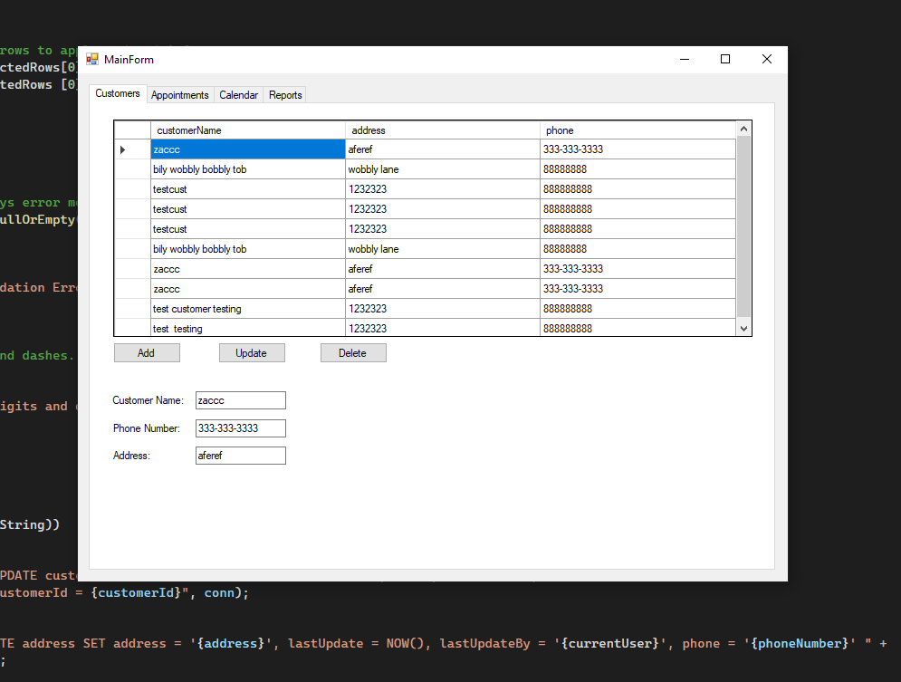
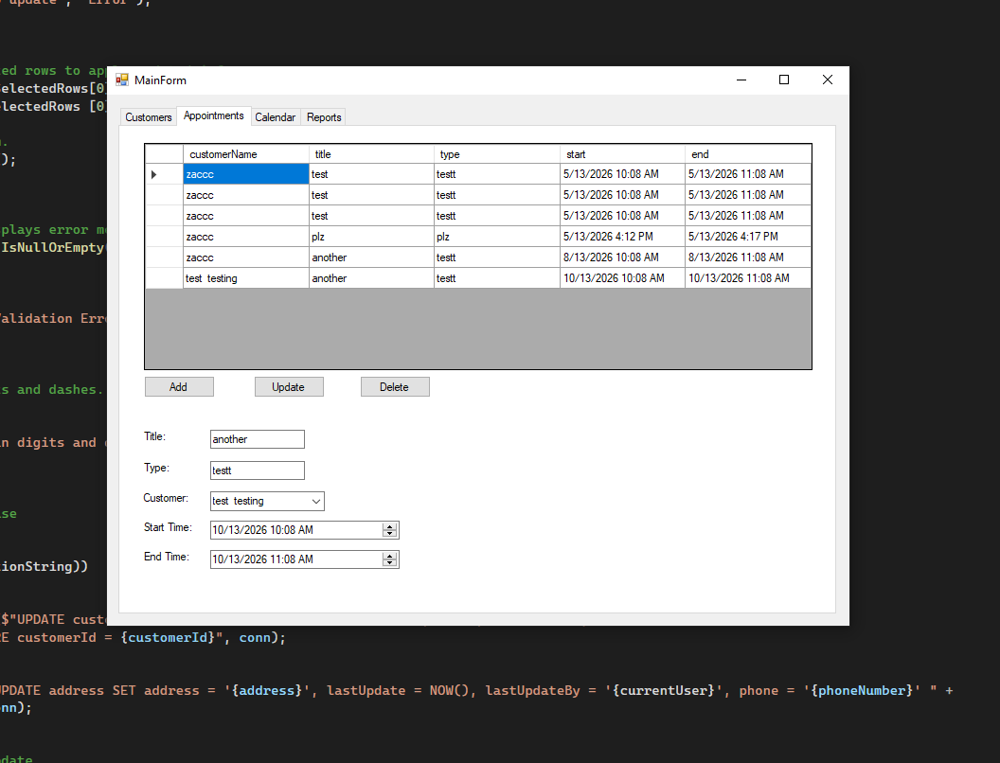
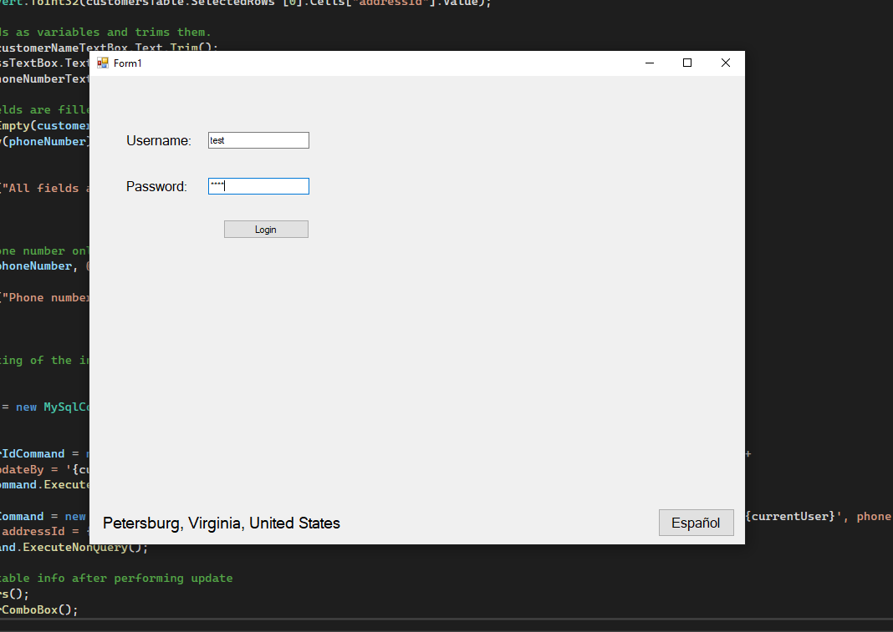

# Scheduling Application

A C# Windows Forms desktop application for managing customer appointments. Built as a WGU C969 performance assessment.

## Features

- User authentication with English/Spanish language support
- Location detection via IP API
- Login history logging
- 15-minute appointment alert on login
- Customer CRUD operations
- Appointment CRUD operations with timezone handling
- Calendar view for appointments - in progress
- Reports generated with LINQ and lambda expressions - in progress

## Tech Stack

- C# / .NET Framework
- Windows Forms
- MySQL Database
- MySql.Data NuGet package

## Screenshots

### Customer Management

### Appointment Management

### Login Form

## Database & Data Layer

This project uses MySQL with data access through raw ADO.NET via the MySql.Data connector (no ORM). I went without an ORM deliberately to keep direct control over the SQL and to deepen my understanding of query design.

### Schema
Six tables with enforced foreign key relationships: `user`, `customer`, `appointment`, `address`, `city`, and `country`. Location data is normalized through a `customer → address → city → country` chain. Every table includes standard audit columns (`createDate`, `createdBy`, `lastUpdate`, `lastUpdateBy`).

### Data Access
All queries execute through `MySqlCommand` / `MySqlDataReader`. The data layer handles CRUD operations for customers and appointments, multi-table joins across the location chain, filtered appointment lookups by user and date range, and authentication against the `user` table.

### Time Zone Handling
Appointment times are stored in UTC and converted to the user's local time zone for display using `TimeZoneInfo`, so the underlying data stays canonical regardless of where the user is.

## Setup

This is a local development project. The connection string with credentials is hardcoded for simplicity since this runs on a local MySQL instance. In a production app these would be moved to a secure config file.

To run:
1. Install MySQL and create a database called `scheduling_db`
2. Run the included `database_setup.sql` script to create tables
3. Update connection string in App.config to match your MySQL credentials
4. Build and run in Visual Studio

## Login

Use `test` / `test` for the username and password.

